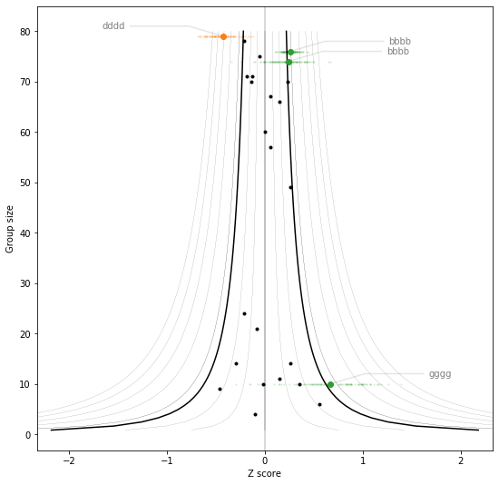

# Funnel plot
> Simple funnelp plots for visualising sub-group variance.


## Install

`pip install funnelplot`

## Examples

### Full caschool example

```python
# load some example data
import pandas as pd
import matplotlib.pyplot as plt
from pydataset import data
from funnelplot.core import funnel
fig,ax = plt.subplots(figsize=(4,9))
ax.set_frame_on(False)

# funnel plot
funnel(df=data("Caschool"), x='testscr', group="county")
```

    1.959963984540054
    


```python
# use bootstrap instead of normal fit
fig,ax = plt.subplots(figsize=(4,9))
ax.set_frame_on(False)
funnel(df=data("Caschool"), x='testscr', group="county", bootstrap_mode=True)
```


### Synthetic data example

```python
## Synthetic data
import numpy as np
import random
random.seed(2020)
np.random.seed(2020)
groups = []
p_mean, p_std = 0, 1
for i in range(25):
    n_group = np.random.randint(1, 80)
    g_std =  np.random.uniform(0.1, 4.5) 
    g_mean = np.random.uniform(-1.9, 0.5)
    groups.append(np.random.normal(p_mean + g_mean,
                                   p_std + g_std, 
                                   n_group))
```

```python


ax, fig = plt.subplots(figsize=(9, 9))
funnel_plot(
    groups,
    labels=[random.choice("abcdefg") * 4 for i in range(len(groups))],
    percentage=97.5,
)
```

    1.959963984540054
    




