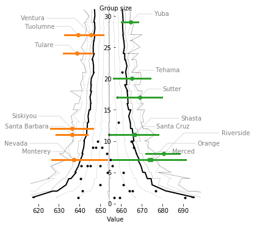
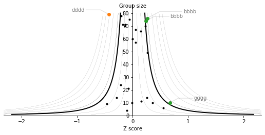

# Funnel plot
> Simple funnel plots for visualising sub-group variance.


This package provides simple [funnel plots](https://psmu.improvement.nhs.uk/psc-shared-library/measurement-evidence-base/16-funnel-plots-for-comparing-institutional-performance/file) in Python, using Matplotlib. This lets you quickly see whether sub-groups of a population are outliers compared to the full population.

Two methods are provided:

* **parametric funnelplot** which uses a standard distribution to estimate the intervals of the funnel (usually a normal distribution)
* **bootstrap funnelplot** which uses bootstrapped percentiles to estimate the intervals of the funnel 

A utility function `funnel()` to make it easy to plot data by grouping Pandas DataFrames in a Seaborn-like API is provided.

## Example
Data of test performance for California schools from [`pydataset/Caschool`](https://pypi.org/project/pydataset/).


## Install

`pip install funnelplot`

## Examples

### Full caschool example

```python
# load some example data
import pandas as pd
import matplotlib.pyplot as plt
from pydataset import data
from funnelplot.core import funnel
fig,ax = plt.subplots(figsize=(4,6))
ax.set_frame_on(False)

# funnel plot, using 0.5% -> 99.5% interval
funnel(df=data("Caschool"), x='testscr', group="county", percentage=99.5)
```


```python
# use bootstrap instead of normal fit
fig,ax = plt.subplots(figsize=(5,6))
ax.set_frame_on(False)
funnel(df=data("Caschool"), x='testscr', group="county", bootstrap_mode=True)
```





### Synthetic data example

```python
## Synthetic data
import numpy as np
import random
random.seed(2020)
np.random.seed(2020)
groups = []
p_mean, p_std = 0, 1
# random groups, with different sizes, means and std. devs.
for i in range(25):
    n_group = np.random.randint(1, 80)
    g_std =  np.random.uniform(0.1, 4.5) 
    g_mean = np.random.uniform(-1.9, 0.5)
    groups.append(np.random.normal(p_mean + g_mean,
                                   p_std + g_std, 
                                   n_group))
```

```python
ax, fig = plt.subplots(figsize=(9, 9))
funnel_plot(
    groups,
    labels=[random.choice("abcdefg") * 4 for i in range(len(groups))],
    percentage=97.5,
)
```




